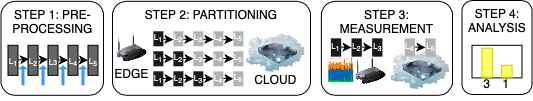

Edge Benchmarking Software for Identifying Adaptivity of Distributed Deep Neural Networks
=========================================================================================

This repository contains the software code developed for benchmarking Deep Neural Networks (DNNs) distributed across the cloud and edge resources on the Keras platform. The aim is to identify whether there is a case for adaptivity - the need for repartitioning the DNN to adapt to changing operational conditions (CPU, memory, or network) once it is already deployed.

### Article on DNN adaptivity and the benchmarking approach
More information on the benchmarking method will be made available here shortly. 

The benchmarking approach is a four step process as shown below. 

Given a DNN model, the approach firstly identifies all partitioning points of the DNN and exhaustively benchmark the DNNs on a given set of cloud and edge resources under different edge CPU and memory stress and different network data transfer rates between the edge and the cloud resource. The measurement data obtained is analysed to identify the best partition points for a given operational condition. The aim of the research is to identify the cases in the DNNs where a repartitioning is required (performance can be improved when the operational condition changes). 

### Citing this work
This work can be cited as follows:
F. McNamee, S. Dustdar, P. Kilpatrick, W. Shi, I. Spence and B. Varghese, "[A Case For Adaptive Deep Neural Networks in Edge Computing](https://arxiv.org/pdf/2008.01814.pdf)," accepted to the IEEE International Conference on Cloud Computing, 2021.

### Instructions for installing the software
This code was tested using Python version 3.8.5 but any version of Python 3 should be fine.

#### Setting up your environment
* Create a Python virtual environment using pip, shown below.

`python3 -m venv env`

* Activate the virtual environment using the source command, shown below.

`source env/bin/activate`

* Install the dependencies using pip and requirements.txt, shown below.

`python -m pip install -r requirements.txt`

#### Pre-partitioning the models
Prior to launching the benchmarking software, each model needs to be pre-partitioned to distribute the DNN across the cloud and the edge. This can be done by using the `cut_models.py` script. This script can be used as shown below. It produces a series of files, located in a folder called `edge_model_<network name>`.

`sudo python3 cut_models.py <network_name>`

The benchmarking software will load these models on the edge to speed up benchmarking. This has already been done for the 8 models we used in our research.

#### Lanuching the server
Using the benchmarking software to conduct experiments should be straightforward. The server should be launched first as shown below.

`sudo python3 benchmarking_server.py <network_name>`

The use of ‘sudo’ is important. The benchmarking software on the edge artificially reduces the network speed with the built-in ‘tc’ command. Updating network rules for ‘tc’ requires ‘sudo’ and therefore the benchmarking software must also be called with ‘sudo’.

If you try to launch the server without providing the name of a network to benchmark, the following error will be displayed:

_Run like this: `sudo python3 benchmarking_server.py <network_name>`_

#### Connect to the server using the client
Once the server has been launched, the Edge node can be launched. It’s important to run the server first because unless the server is running the client won’t have anything to connect to and will timeout.

`sudo python3 benchmarking_client.py <server_address> <network_name>`

The client expects two parameters to be provided, via the command line. One for the server address and one for the network name. Failing to provide the required parameters will result in an error being displayed like the one shown below:

_Run like this: `sudo python3 benchmarking_client.py <server_address> <network_name>`_

Network connections can be unreliable, therefore the benchmarking software will detect failed measurements and automatically re-do them until it can record correct measurements. Therefore there is no need for internal error reporting for the aspect of the software.

